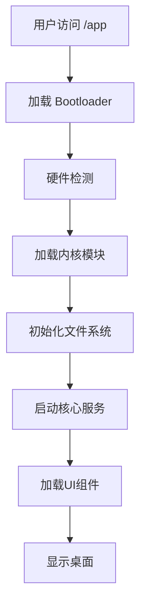
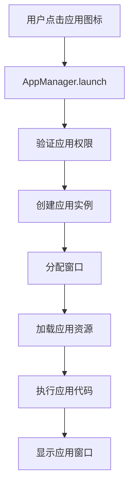
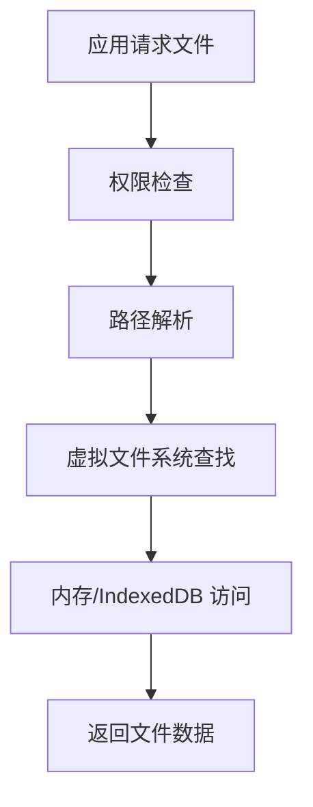

# WebOS 架构文档

## 概述

WebOS 是一个基于 Web 技术的现代操作系统，采用 Monorepo 架构构建。本文档描述了系统的整体架构、模块关系和设计决策。

## 系统架构

### 高层次架构图

```
┌─────────────────────────────────────────────────────────────┐
│                      用户界面层                              │
├─────────────────────────────────────────────────────────────┤
│  ┌─────────────────┐  ┌─────────────────┐  ┌─────────────┐ │
│  │  桌面环境       │  │  应用程序       │  │  系统UI     │ │
│  │  (Desktop)     │  │  (Applications) │  │  (SystemUI) │ │
│  └─────────────────┘  └─────────────────┘  └─────────────┘ │
└─────────────────────────────────────────────────────────────┘
                            │
┌─────────────────────────────────────────────────────────────┐
│                      核心服务层                              │
├─────────────────────────────────────────────────────────────┤
│  ┌─────────────┐  ┌─────────────┐  ┌─────────────┐         │
│  │  内核API    │  │  文件系统   │  │  应用管理   │         │
│  │  (Kernel)  │  │  (Filesystem)│  │  (AppManager)│        │
│  └─────────────┘  └─────────────┘  └─────────────┘         │
└─────────────────────────────────────────────────────────────┘
                            │
┌─────────────────────────────────────────────────────────────┐
│                      基础设施层                              │
├─────────────────────────────────────────────────────────────┤
│  ┌─────────────┐  ┌─────────────┐  ┌─────────────┐         │
│  │  存储       │  │  网络       │  │  安全       │         │
│  │  (Storage) │  │  (Network)  │  │  (Security) │         │
│  └─────────────┘  └─────────────┘  └─────────────┘         │
└─────────────────────────────────────────────────────────────┘
```

## 模块分解

### 1. 内核模块 (@kernel)

**职责**:
- 提供核心系统 API (`window.webos`)
- 管理窗口、进程、资源
- 处理系统事件和消息传递

**关键组件**:
- **API 核心** (`core/api.ts`): 全局 API 入口
- **窗口管理器** (`core/windowManager.ts`): 窗口创建、管理
- **用户管理器** (`core/userManager.ts`): 用户认证和会话
- **安全系统** (`core/secure*`): 加密、安全存储

### 2. 文件系统模块 (@kernel/fs)

**职责**:
- 提供虚拟文件系统 API
- 管理文件和目录权限
- 支持持久化存储

**关键组件**:
- **文件系统实现** (`core/FileSystem.ts`): 文件操作接口
- **权限管理** (`core/Permissions.ts`): 访问控制
- **节点管理** (`core/Node.ts`): 文件和目录表示

### 3. 应用管理器模块 (@kernel/app-manager)

**职责**:
- 应用注册和发现
- 应用生命周期管理
- 应用间通信

**关键组件**:
- **应用注册表** (`registry.tsx`): 应用注册和查询
- **类型定义** (`types.ts`): 应用相关的 TypeScript 类型
- **安装管理**: 应用安装和卸载逻辑

### 4. UI 组件库 (@ui)

**职责**:
- 提供可重用的 UI 组件
- 主题和样式系统
- 响应式设计支持

**组件分类**:
- **基础组件**: Button、Icon、Typography 等
- **布局组件**: Grid、Stack、Flex 等
- **桌面组件**: Desktop、Taskbar、Window 等
- **反馈组件**: Modal、Toast、Notification 等

### 5. 国际化模块 (@i18n)

**职责**:
- 多语言支持
- 本地化资源管理
- 语言切换

**关键组件**:
- **语言管理器**: 加载和切换语言包
- **翻译工具**: 字符串翻译功能
- **区域设置**: 日期、时间、数字格式化

### 6. 启动加载器 (@bootloader)

**职责**:
- 系统启动和初始化
- 硬件检测（浏览器环境模拟）
- 内核加载和验证

**启动阶段**:
1. **硬件检测**: 检查浏览器能力和功能
2. **内核加载**: 加载内核模块
3. **文件系统初始化**: 挂载虚拟文件系统
4. **服务启动**: 启动核心服务
5. **桌面准备**: 准备用户界面

### 7. 应用程序 (@apps)

**内置应用**:
- **时钟** (`com.os.clock`): 显示时间和闹钟
- **文件管理器** (`com.os.filemanager`): 文件浏览和管理
- **设置** (`com.os.settings`): 系统配置
- **终端** (`com.os.terminal`): 命令行界面
- **浏览器** (`com.os.browser`): 网页浏览

## 数据流

### 1. 启动流程



### 2. 应用启动流程



### 3. 文件系统操作



## 技术栈

### 运行时环境
- **浏览器**: Chrome、Firefox、Safari 等现代浏览器
- **JavaScript 引擎**: V8、SpiderMonkey、JavaScriptCore

### 核心框架
- **前端框架**: React 19 + TypeScript 6
- **构建工具**: Next.js 16 (主入口)、Webpack 5 (独立构建)
- **包管理器**: Bun
- **样式系统**: CSS Modules + 自定义主题系统

### 存储方案
- **内存存储**: 运行时数据
- **IndexedDB**: 持久化数据存储
- **Web Crypto API**: 加密和安全存储
- **SQL.js**: SQLite in WASM (数据库)

### 通信机制
- **窗口间通信**: `postMessage` API
- **应用间通信**: 自定义 IPC 系统
- **服务通信**: EventEmitter 模式

## 设计模式

### 1. 单例模式
- **应用场景**: 内核 API、文件系统、应用管理器
- **实现方式**: 全局对象 (`window.webos`)、模块级导出

### 2. 观察者模式
- **应用场景**: 事件系统、状态变更通知
- **实现方式**: EventEmitter、React Context

### 3. 工厂模式
- **应用场景**: 窗口创建、应用实例化
- **实现方式**: 创建函数、类工厂

### 4. 策略模式
- **应用场景**: 主题系统、语言切换、文件系统后端
- **实现方式**: 接口实现、配置驱动

### 5. 组合模式
- **应用场景**: UI 组件树、文件系统目录结构
- **实现方式**: React 组件组合、树形数据结构

## 安全性设计

### 1. 沙箱机制
- **应用隔离**: 每个应用运行在独立上下文中
- **权限控制**: 基于能力的权限系统
- **资源限制**: CPU、内存、存储限制

### 2. 数据加密
- **存储加密**: 用户数据加密存储
- **传输安全**: HTTPS 通信
- **密钥管理**: 安全的密钥存储和轮换

### 3. 权限系统
- **权限级别**: 读取、写入、执行、管理
- **权限授予**: 用户确认、自动授予（系统应用）
- **权限撤销**: 随时可以撤销应用权限

## 性能优化

### 1. 代码分割
- **按需加载**: 动态导入应用和组件
- **懒加载**: 非关键资源延迟加载
- **预加载**: 关键路径资源预加载

### 2. 缓存策略
- **资源缓存**: 静态资源长期缓存
- **数据缓存**: API 响应缓存
- **应用缓存**: 已加载应用缓存

### 3. 渲染优化
- **虚拟化**: 列表和表格虚拟滚动
- **懒渲染**: 离屏内容延迟渲染
- **批处理**: 状态更新批处理

## 扩展性设计

### 1. 插件系统
- **开发者插件**: 开发工具和调试插件
- **主题插件**: 自定义主题和样式
- **功能插件**: 扩展系统功能

### 2. 第三方应用
- **应用商店**: 第三方应用分发
- **安全审核**: 应用安全审查
- **沙箱运行**: 第三方应用隔离运行

### 3. API 扩展
- **核心 API**: 稳定、向后兼容
- **实验性 API**: 新功能测试
- **第三方 API**: 扩展 API 生态系统

## 构建和部署

### 1. 构建模式
- **独立模式**: Webpack 构建，直接运行
- **Next.js 模式**: Next.js 构建，集成到网站

### 2. 环境配置
- **开发环境**: 热重载、调试工具
- **测试环境**: 自动化测试、代码覆盖率
- **生产环境**: 代码优化、安全配置

### 3. 部署策略
- **静态部署**: CDN 分发静态资源
- **动态部署**: 服务端渲染和 API
- **渐进式部署**: 新功能逐步发布

## 故障排除

### 1. 常见问题
- **启动失败**: 检查浏览器兼容性、控制台错误
- **应用崩溃**: 查看应用日志、内存使用
- **性能问题**: 使用性能分析工具

### 2. 调试工具
- **开发者工具**: 浏览器开发者工具
- **系统监控**: 性能监控、错误追踪
- **日志系统**: 结构化日志记录

### 3. 恢复机制
- **安全模式**: 最小功能启动
- **数据恢复**: 备份和恢复机制
- **系统重置**: 重置到初始状态

## 未来发展

### 1. 短期规划
- 完善现有应用功能
- 增强开发者工具
- 优化性能和稳定性

### 2. 中期规划
- 支持更多第三方应用
- 增强多用户支持
- 改进移动端体验

### 3. 长期规划
- 分布式文件系统
- AI 集成和智能助手
- 跨平台支持

---

*最后更新: 2024-01-01*
*本文档应随着系统发展而更新。架构变更应记录在 CHANGELOG 中。*